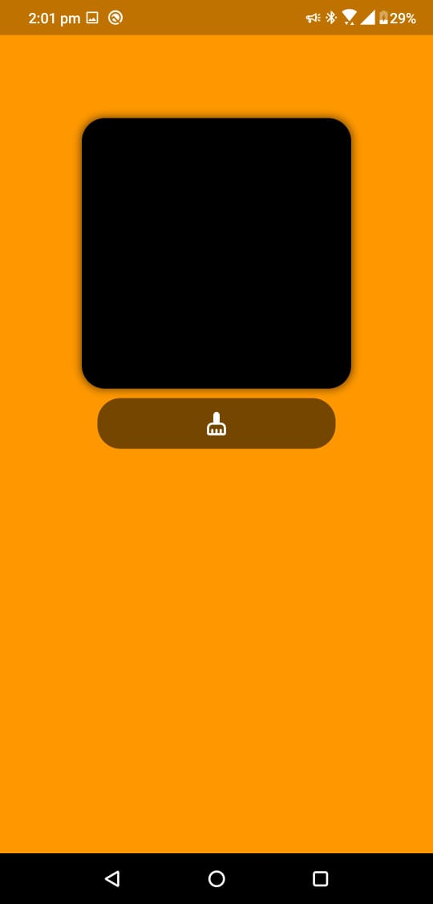
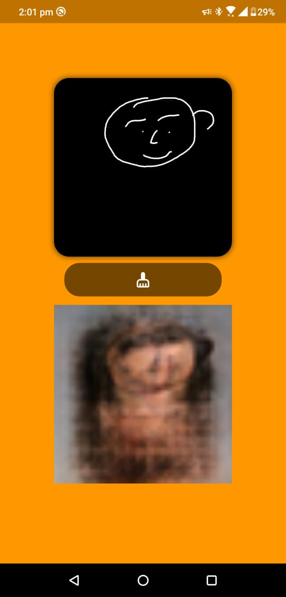

# sketch_2_real

## Screensots

    
    

## Getting Started

This project is a starting point for a Flutter application that follows the
[simple app state management
tutorial](https://flutter.dev/docs/development/data-and-backend/state-mgmt/simple).

For help getting started with Flutter, view our
[online documentation](https://flutter.dev/docs), which offers tutorials,
samples, guidance on mobile development, and a full API reference.
